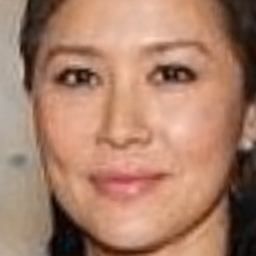
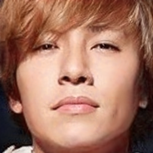
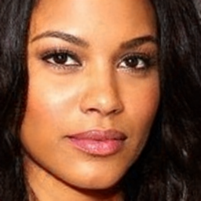
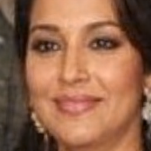
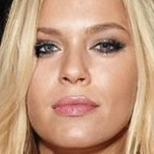
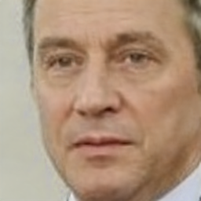

# SynthPar: Synthetic Faces with Demographic Parity

SynthPar aims to facilitate the development and evaluation of face recognition models, with the goal of closing the gap in performance across all demographic groups.

It provides 2 key resources:

- A conditional StyleGAN2 [generator](https://huggingface.co/pravsels/synthpar) that allows users to create synthetic face images for specified attributes like race and sex.
    
- A [dataset](https://huggingface.co/datasets/pravsels/synthpar) of 80,000 synthetic face images evenly distributed across 4 races (Asian, White, Indian, Black) and 2 sexes (Male, Female), built with [VGGFace2](https://github.com/ox-vgg/vgg_face2) dataset and labels.

<div style="display: grid; grid-template-columns: repeat(4, 1fr); gap: 5px; align-items: center; justify-items: center;">
  
  
  
  
  
  
  
  
</div>

<p>Examples generations from the 8 categories of the SynthPar model.</p>


## Loading the dataset

The dataset can be loaded from the HuggingFace repository:

```
from datasets import load_dataset

dataset = load_dataset("pravsels/synthpar")
```

To load the images in a folder of your choosing and have control over the number of sharded zip files to download, use the `dload_hf_dataset.py` script. 


## Generating images

Setup anaconda environment:
```
./install_conda_env.sh
```

Activate the environment:
```
conda activate synthpar
```

Run the generation script with the desired configuration:
```
python generation_script.py -c configs/BlackFemale.yaml
```

Please find the configs for the other demographics in the `configs` folder. 


## Docker support 

To build and run the docker container, use `docker_build.sh` and `run_docker_container.sh` scripts respectively.

Once the container is running, the generation script can be run as expected. 


## Licence 

The code, [dataset](https://huggingface.co/datasets/pravsels/synthpar) and [model](https://huggingface.co/pravsels/synthpar) are released under the MIT license. 

